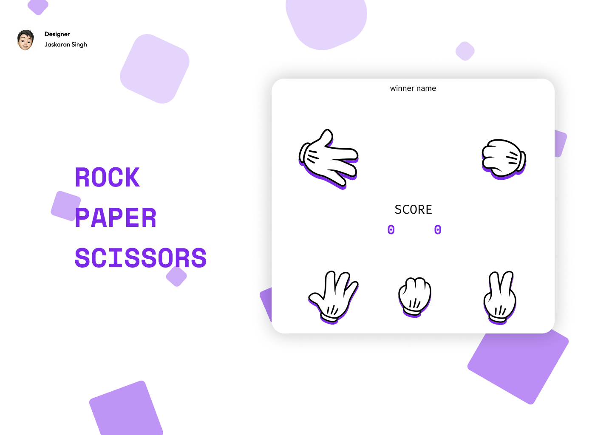

<h1 align="center"> Rock - Paper - Scissor </h1>

Projeto - Jogo

  <a href="#-tecnologias">Tecnologias</a>&nbsp;&nbsp;&nbsp;|&nbsp;&nbsp;&nbsp;
  <a href="#-layout">Layout</a>&nbsp;&nbsp;&nbsp;|&nbsp;&nbsp;&nbsp;
  <a href="#memo-licença">Licença</a>

  

 

  

## 🚀 Tecnologias

Esse projeto foi desenvolvido com as seguintes tecnologias:

- HTML e CSS
- JavaScript
- Git e Github
- Figma
- Responsividade

## 🔖 Layout

[Confira o layout do meu projeto no Figma:](https://www.figma.com/community/file/1310355674260386808/game-rock-paper-scissors)

## :memo: Licença

Esse projeto está sob a licença MIT.

---
